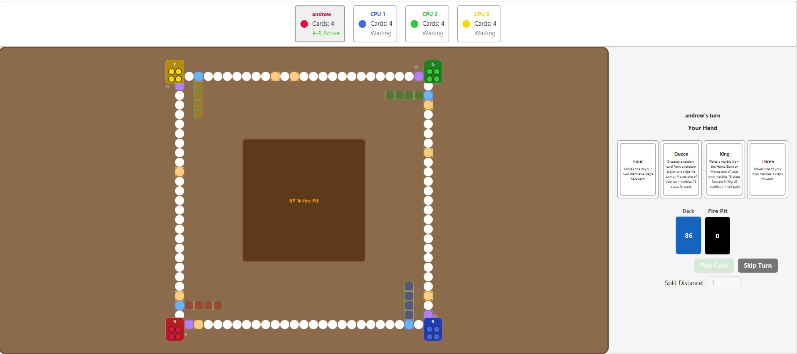

# 🎲 Jackaroo — A New Game Spin

> A JavaFX reimagination of the classic Middle-Eastern board/card game **Jackaroo**, built as a GUC Computer-Programming Lab project (Spring 2025).


---

## 🖼️ Screenshot



> 4-player game in progress — human (Red) vs 3 CPU opponents (Blue, Green, Yellow). Cards panel on the right shows your hand, deck count, and fire pit.

---

## 📖 Table of Contents

- [About the Game](#-about-the-game)
- [Features](#-features)
- [Project Structure](#-project-structure)
- [Getting Started](#-getting-started)
  - [Prerequisites](#prerequisites)
  - [Running with Eclipse](#running-with-eclipse)
  - [Running with IntelliJ IDEA](#running-with-intellij-idea)
  - [Running from the Command Line](#running-from-the-command-line)
- [How to Play](#-how-to-play)
- [Game Rules](#-game-rules)
  - [Board Zones](#board-zones)
  - [Card Reference](#card-reference)
- [Architecture Overview](#-architecture-overview)
- [Running the Tests](#-running-the-tests)
- [Authors](#-authors)

---

## 🃏 About the Game

Jackaroo is a Lebanese/Middle-Eastern strategy board game combining marble movement with card play. This implementation is a single-player Java desktop game where you control **four marbles** racing against **three CPU opponents** around a 100-cell circular track. The first player to move all four marbles into their Safe Zone wins.

---

## ✨ Features

- 🖥️ Full **JavaFX GUI** with FXML-based views and custom CSS styling
- 🤖 **CPU AI** opponents that automatically play valid moves each turn
- 🃏 **102-card deck** loaded from `Cards.csv`, featuring 15 card types including wild cards
- ⚡ **Wild cards** — *MarbleBurner* and *MarbleSaver* for dramatic comebacks
- 🪤 **8 hidden Trap Cells** that destroy any marble landing on them
- 🔀 **Seven Split** — divide 7 steps across two marbles
- 🔄 **Jack Swap** — swap one of your marbles with an opponent's
- 💥 **King destroy** — bulldoze every marble in your path when moving 13 steps

---

## 📁 Project Structure

```
JackarooM2Solution/
├── Cards.csv                        # Card pool definitions (102 cards, 15 types)
├── src/
│   ├── engine/
│   │   ├── Game.java                # Core game orchestrator (turn flow, win detection)
│   │   ├── GameManager.java         # Interface: field / burn / discard / sendHome
│   │   └── board/
│   │       ├── Board.java           # 100-cell track, safe zones, movement & collision logic
│   │       ├── BoardManager.java    # Interface: actionable marbles, movement helpers
│   │       ├── Cell.java            # Single board cell
│   │       ├── CellType.java        # NORMAL | BASE | ENTRY | TRAP | SAFE
│   │       └── SafeZone.java        # Per-player 4-cell safe destination
│   ├── exception/                   # Typed game exceptions
│   │   ├── GameException.java       # Base exception
│   │   ├── ActionException.java
│   │   ├── CannotFieldException.java
│   │   ├── CannotDiscardException.java
│   │   ├── IllegalDestroyException.java
│   │   ├── IllegalMovementException.java
│   │   ├── IllegalSwapException.java
│   │   ├── InvalidCardException.java
│   │   ├── InvalidMarbleException.java
│   │   ├── InvalidSelectionException.java
│   │   └── SplitOutOfRangeException.java
│   ├── model/
│   │   ├── Colour.java              # RED | GREEN | BLUE | YELLOW
│   │   ├── card/
│   │   │   ├── Card.java            # Abstract base card
│   │   │   ├── Deck.java            # Card pool loader & draw logic
│   │   │   ├── standard/            # Ace, King, Queen, Jack, Ten, Seven, Five, Four, Standard
│   │   │   └── wild/                # Wild (abstract), Burner, Saver
│   │   └── player/
│   │       ├── Player.java          # Human player logic & selection state
│   │       ├── CPU.java             # CPU player with random-valid-move AI
│   │       └── Marble.java          # Single marble with position tracking
│   ├── view/
│   │   ├── Main.java                # JavaFX Application entry point
│   │   ├── HomeController.java      # Welcome screen controller
│   │   ├── HomeView.fxml            # Welcome screen layout
│   │   ├── JackarooController.java  # Main game GUI controller
│   │   ├── JackarooView.fxml        # Game board layout
│   │   ├── game-style.css           # Main game stylesheet
│   │   └── home.css                 # Welcome screen stylesheet
│   └── test/
│       ├── Milestone1PublicTests.java
│       ├── Milestone1PrivateTests.java
│       └── Milestone2PublicTests.java
└── .gitignore
```

---

## 🚀 Getting Started

### Prerequisites

| Requirement | Version |
|-------------|---------|
| Java (JDK)  | 11 or higher |
| JavaFX SDK  | 17 or higher |

Download JavaFX from [gluonhq.com/products/javafx](https://gluonhq.com/products/javafx/).

> **Important:** `Cards.csv` must be present in the **project root** (working directory) when the application starts. Eclipse and IntelliJ both default to the project root as the working directory, so no extra steps are needed.

---

### Running with Eclipse

1. **Import the project:**  
   `File → Import → General → Existing Projects into Workspace` → select the `JackarooM2Solution/` folder.

2. **Add JavaFX to the build path:**  
   Right-click project → `Build Path → Add External Archives…` → select all `.jar` files from your JavaFX SDK's `lib/` folder.

3. **Configure VM arguments:**  
   Open `Run Configurations` for `view.Main`, go to the **Arguments** tab, and add:
   ```
   --module-path /path/to/javafx-sdk/lib --add-modules javafx.controls,javafx.fxml
   ```

4. **Run** `view.Main` as a Java Application.

---

### Running with IntelliJ IDEA

1. **Open** the project folder in IntelliJ (`File → Open`).

2. **Add JavaFX library:**  
   `File → Project Structure → Libraries → + → Java` → select the JavaFX SDK `lib/` folder.

3. **Configure VM options:**  
   `Run → Edit Configurations → Modify options → Add VM options`:
   ```
   --module-path /path/to/javafx-sdk/lib --add-modules javafx.controls,javafx.fxml
   ```

4. Set the main class to `view.Main` and click **Run**.

---

### Running from the Command Line

```bash
# Compile (from the project root)
javac --module-path /path/to/javafx-sdk/lib \
      --add-modules javafx.controls,javafx.fxml \
      -d bin \
      src/engine/*.java src/engine/board/*.java \
      src/exception/*.java src/model/*.java \
      src/model/card/*.java src/model/card/standard/*.java \
      src/model/card/wild/*.java src/model/player/*.java \
      src/view/*.java

# Run
java --module-path /path/to/javafx-sdk/lib \
     --add-modules javafx.controls,javafx.fxml \
     -cp bin view.Main
```

---

## 🎮 How to Play

1. **Welcome screen** — Enter your name and click **Start Game**.
2. **Your hand** of 4 cards appears on the right panel.
3. **Click a card** to select it. An action menu will appear (e.g. *Field Marble*, *Move Forward*).
4. **Click a marble** on the board to target it (selected marbles are highlighted in gold).
   - *Seven Split*: enter the split distance first, then click two marbles.
   - *Jack Swap*: click **your** marble first, then an **opponent's** marble.
5. Click **Play Card** to execute the move, or **Skip Turn** to discard without playing.
6. CPU players act automatically after a short delay.
7. **Win** by placing all 4 of your marbles inside your Safe Zone!

---

## 📜 Game Rules

### Board Zones

| Zone | Description |
|------|-------------|
| **Home Zone** | Starting area — marbles are inactive until fielded |
| **Base Cell** | Entry point onto the circular track (play Ace or King to field) |
| **Track** | 100-cell clockwise loop; landing on an opponent destroys their marble |
| **Safe Zone** | 4-cell final destination per player — immune to attacks |
| **Trap Cells** | 8 randomly placed hidden cells — any marble landing here is sent home |

### Card Reference

| Card | Primary Action | Alternative |
|------|----------------|-------------|
| **Ace** | Field a marble from Home | Move forward 1 |
| **2, 3, 6, 8, 9** | Move forward N steps | — |
| **Four** | Move backward 4 | — |
| **Five** | Move *any* marble forward 5 | — |
| **Seven** | Split 7 steps across 2 marbles | Move forward 7 |
| **Ten** | Discard next player's top card | Move forward 10 |
| **Jack** | Swap your marble ↔ opponent's marble | Move forward 11 |
| **Queen** | Discard a random player's card | Move forward 12 |
| **King** | Field a marble from Home | Move forward 13 (destroys path) |
| **MarbleBurner** *(wild)* | Send any opponent marble back to Home | — |
| **MarbleSaver** *(wild)* | Teleport your marble directly into Safe Zone | — |

---

## 🏗️ Architecture Overview

The project follows an **MVC-like layered architecture**:

```
View (JavaFX / FXML)
       │  user events
       ▼
  Game (engine)  ←──────── GameManager interface
       │
  Board (engine/board)  ←── BoardManager interface
       │
  Model (players, cards, marbles)
```

- **`Game`** drives the turn loop, deals hands, detects the win condition, and routes exceptions to the GUI.
- **`Board`** owns the 100-cell track and four `SafeZone` objects; all movement, collision, and trap logic lives here.
- **`Deck`** reads `Cards.csv` at startup and builds the shuffled card pool.
- **`CPU`** picks a random valid card + marble combination on each turn, delegating movement queries to `BoardManager`.
- The `GameManager` and `BoardManager` interfaces decouple the engine from both the view and the AI, making each layer independently testable.

---

## 🧪 Running the Tests

Test files are located in `src/test/`. They use **JUnit** and reference the engine/model packages directly.

To run in Eclipse: right-click `src/test/` → `Run As → JUnit Test`.

> The test suite covers Milestone 1 (model & board logic) and Milestone 2 (full game flow and GUI interactions).

---

## 👥 Authors

Developed at **German University in Cairo (GUC)**  
Media Engineering & Technology — Computer Programming Lab, Spring 2025
